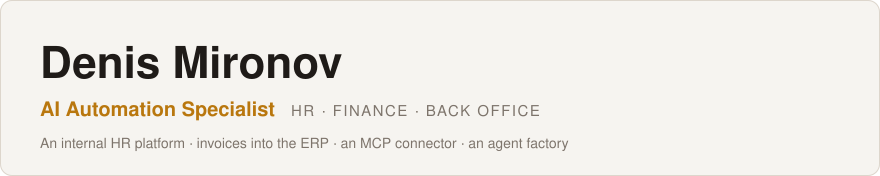
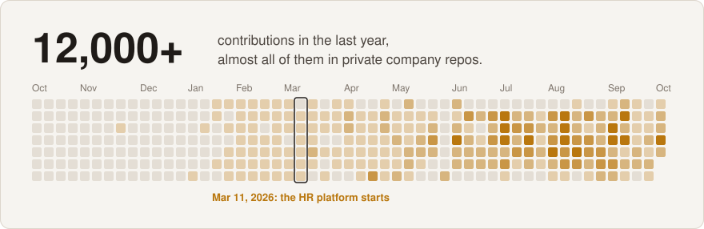
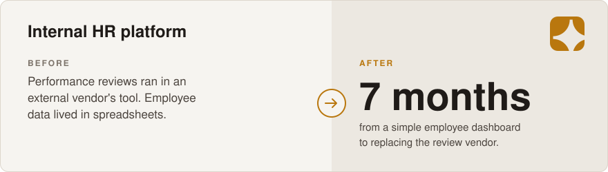
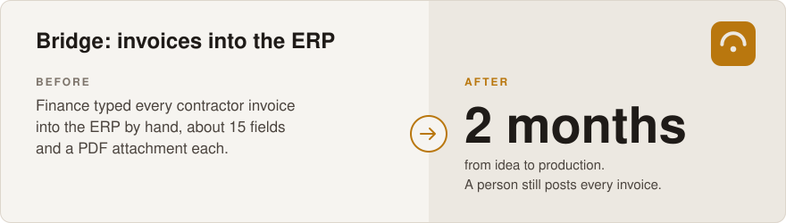
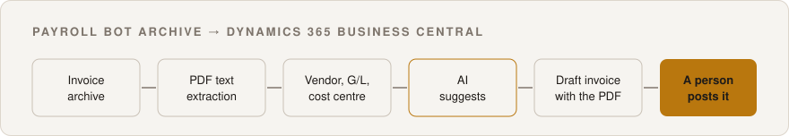
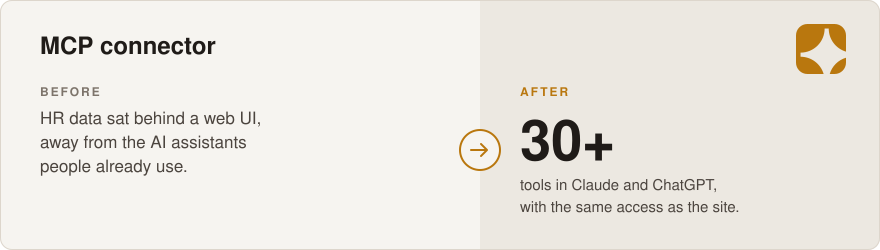
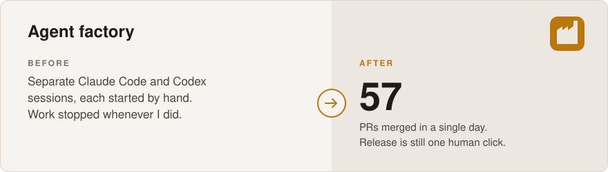
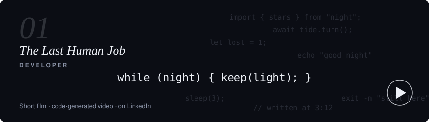

<picture>
  <source media="(prefers-color-scheme: dark)" srcset="assets/header-dark.svg">
  
</picture>

<picture>
  <source media="(prefers-color-scheme: dark)" srcset="assets/contributions-dark.svg">
  
</picture>

## Cases

<picture>
  <source media="(prefers-color-scheme: dark)" srcset="assets/hr-platform-dark.svg">
  
</picture>

**Idea.** Start with one page where HR can see every employee. Keep adding what people ask for, until the company no longer needs an outside tool for performance reviews.

**Modules today.** Performance review and goals, org chart, payroll with a Slack bot for invoices and payslips, compensation and grades, surveys, recruitment budget, HR analytics and an AI HR assistant.

<b>How it grew</b>

- **March 2026.** An employee dashboard, synced one way from the HR system of record. The platform never writes back.
- **Next.** The spreadsheets HR kept asking about moved in one module at a time: salary reviews, grades, bonuses.
- **April 2026.** Work on the review module began. Past review cycles were imported from the vendor, so nobody lost their history.
- **Pilot.** One full review cycle on a small test group before going company-wide.
- **H2 2026.** The company-wide review runs here: goals, self-review, manager review and calibration.

No model decides anything about a person. AI helps draft goals and review text, and people set every score.

**Who uses it.** Every employee sets goals and writes a self-review here, managers review their teams, and HR runs the cycle. About 330 people.

`Next.js 16` `React 19` `TypeScript` `Postgres` `pgTAP` `Claude API` `Slack`

<picture>
  <source media="(prefers-color-scheme: dark)" srcset="assets/bridge-dark.svg">
  
</picture>

**Idea.** Take invoices straight from the payroll bot's archive, so the ERP draft is already filled in when finance opens it.

<b>How it was solved</b>

 

<picture>
  <source media="(prefers-color-scheme: dark)" srcset="assets/bridge-flow-dark.svg">
  
</picture>

- The system prepares drafts and a person posts them. Posting is blocked in code.
- The draft lives in the ERP itself, so there is one source of truth to check.
- Every reference is rechecked against the live ERP right before a write. Free-text codes are never accepted.
- If it's unclear whether an invoice already exists, a person decides. Nothing is created twice blindly.
- AI does two narrow jobs: it suggests a cost centre for a person to confirm, and finds the service description in the PDF, accepted only if it matches the PDF word for word.

**Who uses it.** The finance team prepares and approves. More than 1,400 tests guard the rules.

`Next.js` `SQLite` `Business Central API` `Claude API`

<picture>
  <source media="(prefers-color-scheme: dark)" srcset="assets/mcp-dark.svg">
  
</picture>

**Idea.** Let people ask "what are my goals" or "submit my self-review" in the assistant they already use.

<b>How it was solved</b>

- Each request runs as the signed-in person, so the AI sees exactly what that person sees on the site.
- Writes are never retried automatically, so a timeout can't create something twice.
- A failed read shows up as an error, never as an empty answer, so the model doesn't act on missing data.

**Who uses it.** Platform users, scoped by role. Compensation tools are HR-only.

`MCP SDK` `OAuth 2.1` `Postgres`

<picture>
  <source media="(prefers-color-scheme: dark)" srcset="assets/agent-factory-dark.svg">
  
</picture>

**Idea.** Bring Claude Code and Codex into one process that keeps working without me. Every task passes the same checks, and the only human step is the release.

How the factory works is the one thing I keep off this page. Ask me on a call and I'll show it running.

`Claude Code` `Codex` `GitHub Actions`

## What my systems are not allowed to do

| Not allowed | Instead |
|---|---|
| Post an invoice to the books | Bridge only creates drafts. A person posts. |
| Decide a review score, grade or salary | AI drafts text. People set every score and number. |
| Show data a person can't see on the site | AI reads run with that person's own access. |
| Approve requests in bulk without a look | Bulk actions show a preview and need a second confirmation. |
| Touch production | Agents can't. Release is my call. |

## Smaller tools

| What | What it does | Status |
|---|---|---|
| BambooHR MCP server (co-maintainer) | Employees and HR use the HR system from Claude and ChatGPT with their own login. Python, FastMCP. | In use |
| Hiring pipeline agents | One grades interview answers against a role's question bank, another helps hiring managers write role profiles. The recruiter makes the call. | In use |
| Scheduled Claude routines | Seven scheduled tasks, including weekly LinkedIn analytics and a morning brief. | Running |
| Bali Quest (internal AI hackathon) | A 14-day team fitness game where AI plans quests, checks workouts and redraws each team's villa daily. Built in 5 days. | Shipped |

<b>Stack</b>

TypeScript, Next.js, React, Postgres, Supabase, Python, FastMCP, Claude API, Claude Code, Codex, Slack, Jira, BambooHR, Dynamics 365 Business Central

## Experiments

I also keep a blog on LinkedIn, where I write about what I try with AI outside the day job. The latest one is [The Last Human Job](https://www.linkedin.com/feed/update/urn:li:activity:7512118553240797184/), a short film Claude put together as code-generated video. Next I want to build a proper harness around it: MCP servers, image generation, 3D and several models in one pipeline.

I'm glad to walk through any of these on a call. Reach me on [LinkedIn](https://www.linkedin.com/in/denmironov/).
